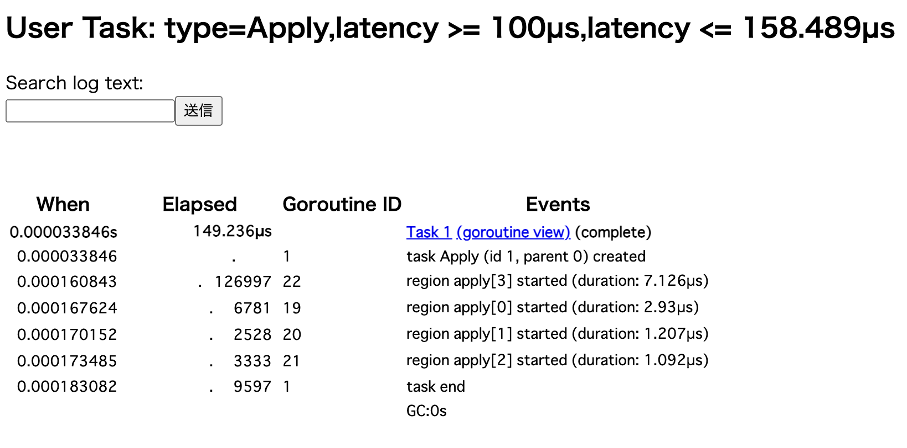

# runtime-trace

`runtime/trace` example

```sh
$ go run main.go
$ go tool trace trace.out
Parsing trace...
Splitting trace...
Opening browser. Trace viewer is listening on http://127.0.0.1:56602
```

